
For README in English, <a href="./README.md" target="blank_">click here</a>

<h2>Pré Visualização</h2>

<h1>Sobre</h1>

Burguer Kenzie é uma simples aplicação que simula um delivery de lanches. Talvez seu único defeito seja não finalizar o pedido 😅. A aplicação faz o consumo de uma api (GET: https://hamburgueria-kenzie-json-serve.herokuapp.com/products), trata os dados de resposta e renderiza-os em tela. Tendo como proposta inicial um projeto simples, tomei a liberdade para desenvolver algumas funcionalidades extras e refatorar alguns pontos do código.

 

<h2>Estruturação de Projeto e Tecnologias</h2>

Neste projeto foram utilizados conceitos de <strong>Consumo de Api</strong>, <strong>React Hooks</strong>, <strong>React Context</strong>, <strong>Componentização</strong> <strong>Renderização Condicional</strong> e <strong>Mobile First</strong>.

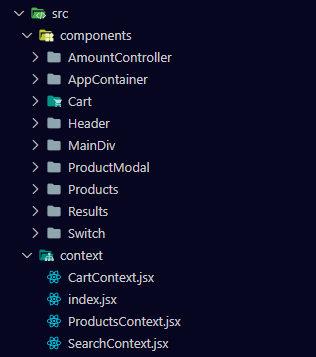

  

<h3>Tecnologias / Bibliotecas</h3>
<ul>
    <li>Axios</li>
    <li>React-Js</li>
    <li>React Context</li>
    <li>Radix (Dialog & Switch)</li>
    <li>Styled-Components</li>
</ul>

 

<h2>Como Funciona</h2>

<h3>Adicionar lanche ao Carrinho</h3>
<table>
    <tbody>
        <tr>
            <td style="text-align: center;" width="50%">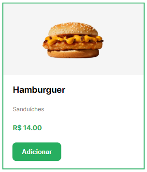</td>
            <td width="50%">
Na tela inicial, temos uma lista com todos os lanches disponíveis. Clicando em <strong>Adicionar</strong>, o produto selecionado vai direto para o carrinho. <strong>Veja abaixo:</strong>
</td>
        </tr>
    </tbody>
</table>

 
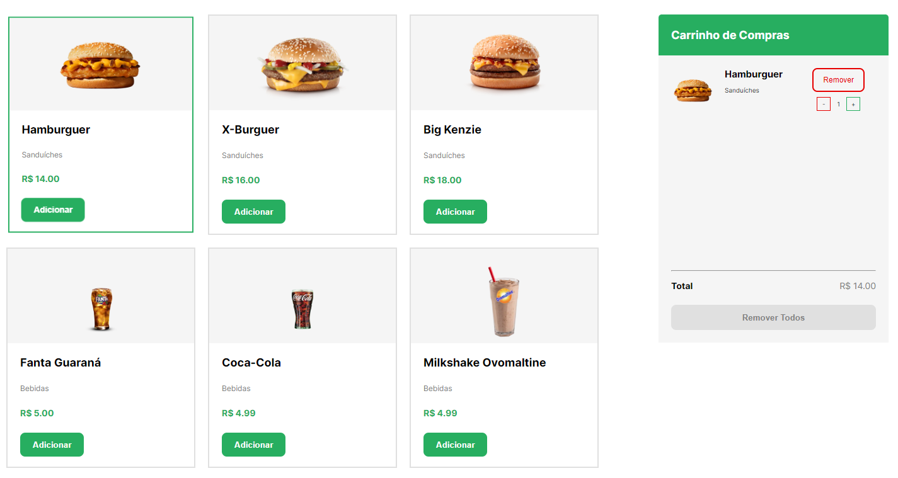
  

<h3>Carrinho</h3>

No lado direito podemos ver o <strong>carrinho</strong>. Aqui temos total controle sobre nossos produtos. Podemos <strong>ajustar a quantidade</strong> dos nossos produtos e também <strong>remover todos</strong> eles. Na parte inferior temos o valor total sendo mostrado na tela e o botão de remover todos os produtos.

<table>
    <tbody>
        <tr>
            <td width="50%" style="text-align: center;">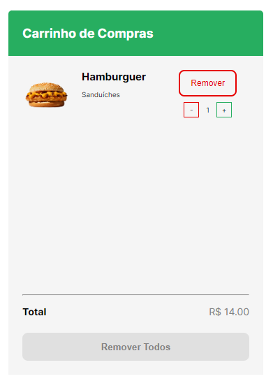</td>
            <td width="50%" style="text-align: center;">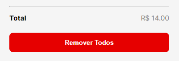</td>
        </tr>
    </tbody>
</table>

  

<h3>Quantidades</h3>

Caso queira adicionar várias quantidades de um mesmo produto de uma só vez, você pode <strong>clicar no card</strong> para abrir um <strong>modal</strong> (ou <strong>caixa de dialogo</strong>), na parte central da tela.

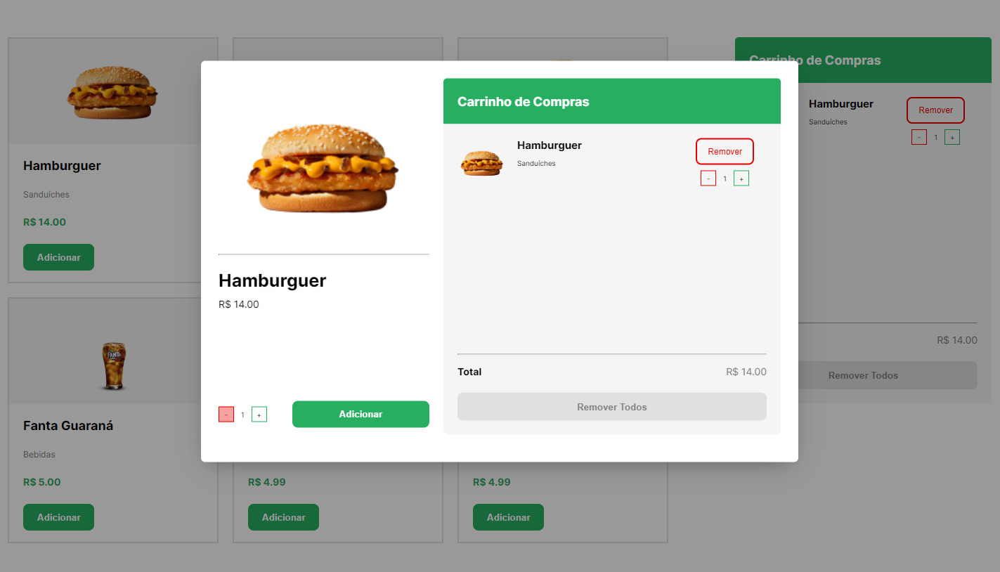
  

Na parte esquerda podemos ver todas as informações disponíveis do lanche selecionado. Na parte inferior conseguimos <strong>selecionar a quantidade desejada</strong> e <strong>adicionar</strong> o produto ao <strong>carrinho</strong>.

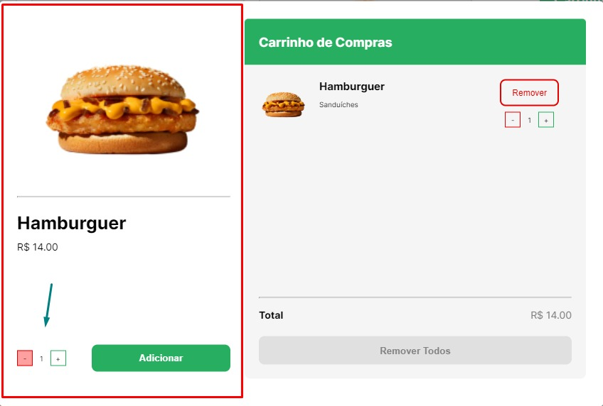

  

Na parte direita conseguimos ver o nosso Componente <strong>"Carrinho"</strong>. Nele conseguimos fazer todas as funções. Adicionar/Remover produtos e suas quantidades e remover todos os produtos.

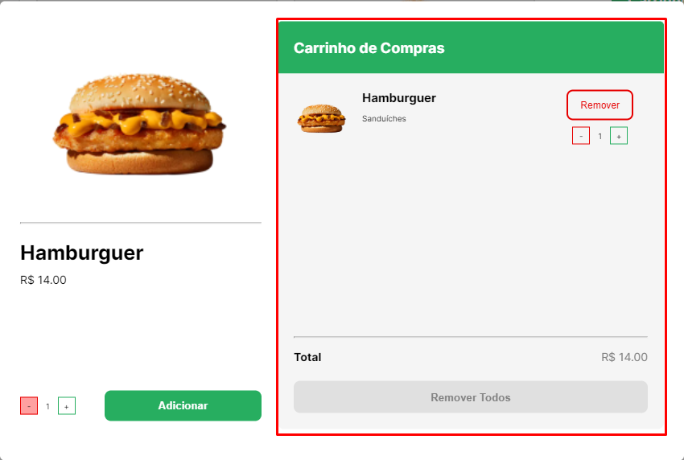

  

<h2>Funcionalidades Extras</h2>

<h3>Darkmode</h3>
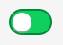
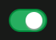
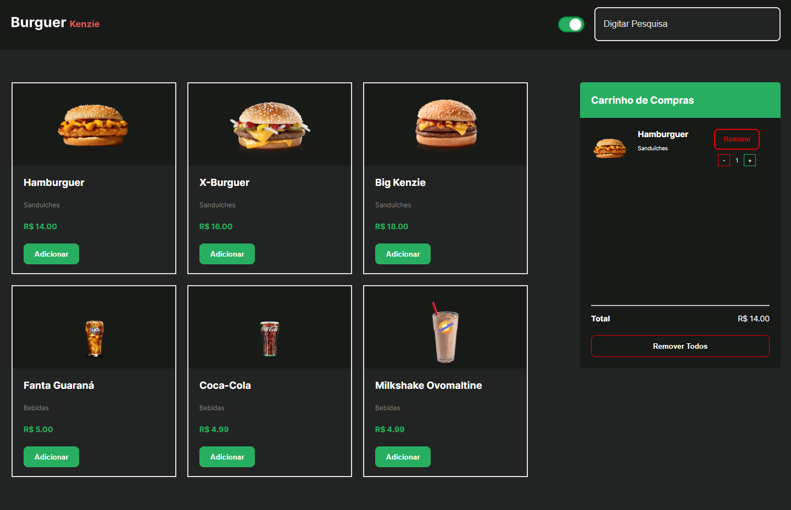
  

<h3>Responsividade e Mobile-First</h3>

<table>
    <tbody>
        <tr>
            <td width="50%" style="text-align: center;">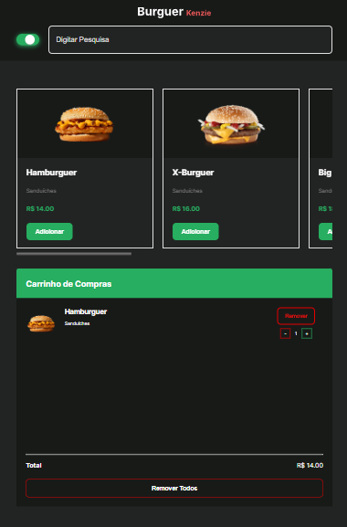</td>
            <td width="50%" style="text-align: center;">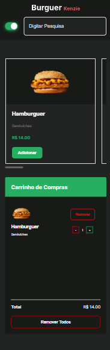</td>
        </tr>
    </tbody>
</table>

  

<h2><strong>Link do Projeto:</strong> <a href="https://kenzie-burguer.igorttdp.vercel.app/" target="blank_">Burguer Kenzie</a></h2>
