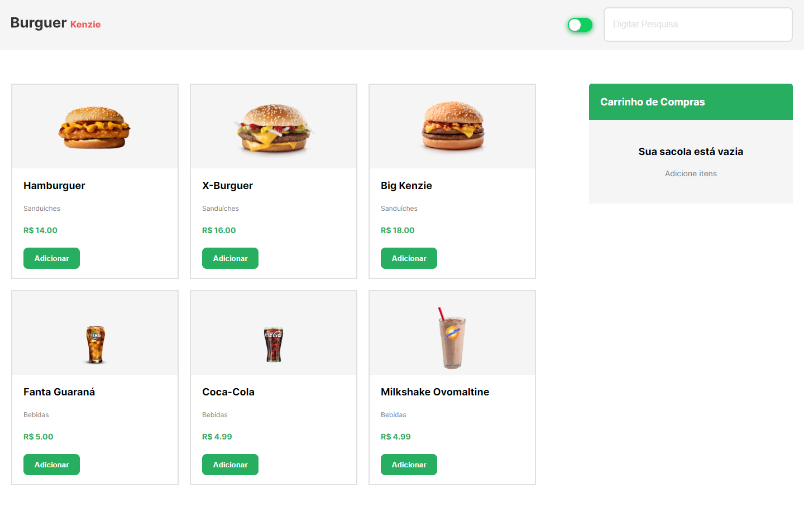
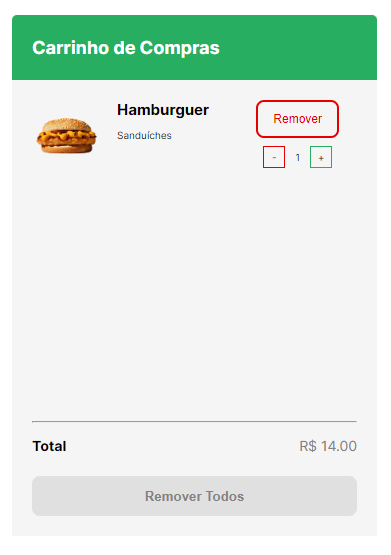
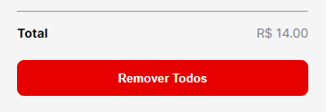
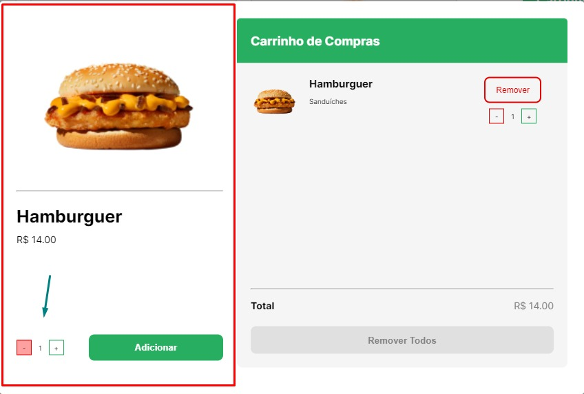
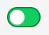
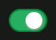
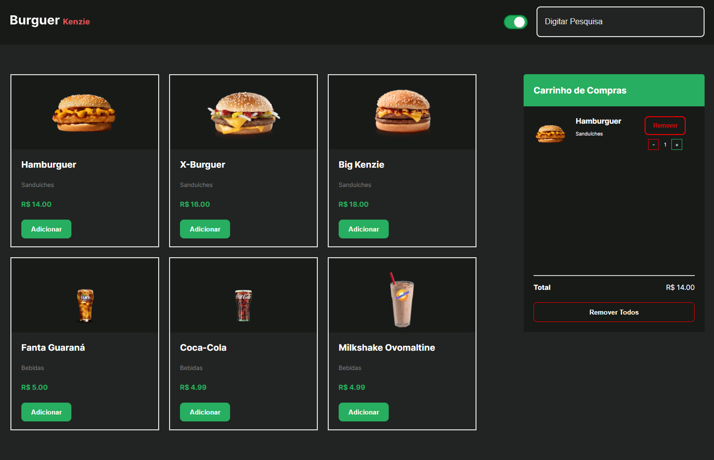

Para README em Português, <a href="./README-ptbr.md" target="blank_">clique aqui</a>

<h2>Preview</h2>

<h1>About</h1>

Burger Kenzie is a simple application that simulates fast food delivery. Perhaps your only defect is not completing the order 😅. The application consumes an api (GET: https://hamburgueria-kenzie-json-serve.herokuapp.com/products), handles the response data and renders it to the screen. Having a simple project as an initial proposal, I took the liberty to develop some extra features and refactor some points of the code.

 

<h2>Project Structuring and Technologies</h2>

In this project, concepts of <strong>API Consumption</strong>, <strong>React Hooks</strong>, <strong>React Context</strong>, <strong>Componentization</strong> <strong>Conditional Rendering</strong> and <strong>Mobile First</strong>.

  

<h3>Technologies / Libs</h3>
<ul>
    <li>Axios</li>
    <li>React-Js</li>
    <li>React Context</li>
    <li>Radix (Dialog & Switch)</li>
    <li>Styled-Components</li>
</ul>

 

<h2>How it Works</h2>

<h3>Add food to Cart</h3>
<table>
    <tbody>
        <tr>
            <td width="50%" style="text-align: center;"></td>
            <td width="50%" style="text-align: center;">
On the home screen, we have a list of all available foods. Clicking on <strong>Add</strong>, the selected product goes directly to the cart. <strong>See below:</strong>
</td>
        </tr>
    </tbody>
</table>

 

  

<h3>Cart</h3>

On the right side we can see the <strong>Cart</strong>. Here we have full control over our products. We can <strong>adjust the quantity</strong> of our products and also <strong>remove all</strong> of them. At the bottom we have the total value being shown on the screen and the button to remove all products.

<table>
    <tbody>
        <tr>
            <td width="50%" style="text-align: center;"></td>
            <td width="50%" style="text-align: center;"></td>
        </tr>
    </tbody>
</table>

  

<h3>Quantities</h3>

If you want to add several quantities of the same product at once, you can <strong>click on the card</strong> to open a <strong>modal</strong> (or <strong>dialog box</strong>), in the center of the screen.

  

In the left part we can see all the available information of the selected snack. At the bottom we can <strong>select the desired quantity</strong> and <strong>add</strong> the product to the <strong>cart</strong>.

  

On the right we can see our Component <strong>"Cart"</strong>. In it we can do all the functions. Add/Remove products and their quantities and remove all products.

  

<h2>Extra Features</h2>

<h3>Darkmode</h3>

  

<h3>Responsiveness and Mobile-First</h3>

<table>
    <tbody>
        <tr>
            <td width="50%" style="text-align: center;"></td>
            <td width="50%" style="text-align: center;"></td>
        </tr>
    </tbody>
</table>

  

<h2><strong>Link of Project:</strong> <a href="https://kenzie-burguer.igorttdp.vercel.app/" target="blank_">Burguer Kenzie</a></h2>
